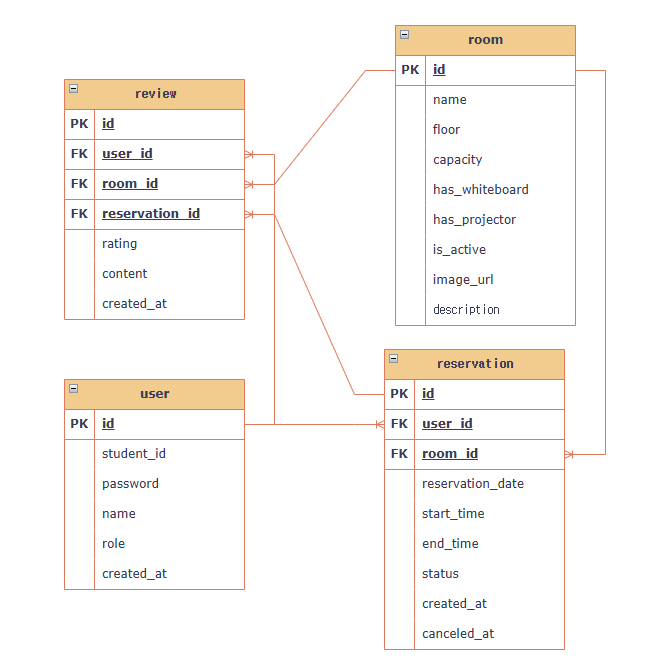

# 🏫 스터디룸 예약 시스템 (Study-Room-Reservation)
### [관리자 계정 : admin 패스워드 : admin1234]

> **청년취업사관학교 도봉캠퍼스 AI 서비스 개발자 과정** 
> 실무 관점의 데이터 설계와 검증 로직 구현을 위한 미니 프로젝트입니다.

---

## 1. 📂 프로젝트 구조 (Repository Structure)

* **study-room-reservation/** (최상위 루트)
    * `.gitignore`
    * `README.md`
    * `uv.lock`
    * `.env` : [v1.1 추가] PostgreSQL 접속 정보 관리
    * **app/**
        * **models/** : [DB 설계도] 테이블 정의 (SQLAlchemy 2.0)
            * `__init__.py` : [v1.1 추가] 모든 모델 통합 관리 및 __all__ 설정
            * `user.py` : 사용자 테이블 및 권한(role) 설정
            * `room.py`, `reservation.py`, `review.py` : 각 핵심 도메인 테이블 정의
        * **schemas/** : [데이터 규격] Pydantic 모델
            * `user.py` : 회원가입 요청 및 유저 응답 데이터 규격
            * `auth.py` : 로그인 및 JWT 토큰 규격
        * **services/** : [핵심 로직] 비즈니스 규칙 및 검증
            * `auth_service.py` : **[v1.4 추가] 회원가입 로직 및 비밀번호 처리**
        * **routers/** : [안내 데스크] API 엔드포인트
            * `auth.py` : **[v1.4 추가] 가입(Signup)/로그인 API 라우팅**
        * **docs/** : [프로젝트 문서화] 설계 및 자료 관리
            * **images/** : ERD v1.2 
            * `learning_log.md` : 트러블슈팅 정리모음집
        * `database.py` : **[v1.4 수정] PostgreSQL 엔진 설정 및 get_db 구현 완료**
        * `main.py` : **[v1.1 수정] 테이블 자동 생성 로직 예정**

---

## 2. 🎯 기획 의도 (Why)

### 2.1 개발 배경
* 학생들이 스터디룸을 예약할 때 발생하는 **중복 예약 문제**와 **무분별한 독점**을 막기 위해 체계적인 예약 시스템이 필요했습니다.

### 2.2 해결하고자 하는 문제
* **중복 예약 방지**: 동일 시간대, 동일 강의실에 대한 중복 예약을 원천 차단합니다.
* **공정한 이용**: 하루 최대 이용 시간을 제한하여 특정 사용자의 독점을 방지합니다.
* **데이터 무결성**: 과거 날짜 예약 금지, 운영 시간 외 예약 금지 등 실무적인 검증 로직을 구현합니다.
* **[v1.1 추가] 서비스 신뢰도 확보**: 실제 이용자만 작성 가능한 리뷰 시스템을 통해 공간 관리를 최적화합니다.
* **[v1.2 추가] 스터디룸 권한**: 관리자 계정으로만 스터디룸에 대한 CUD가 가능하게끔 DB 테이블 설계

---

## 3. 🏗️ 설계 및 구조 (Architecture)

### 3.1 Layered Architecture
* **Router → Service → Repository → Model**로 이어지는 4계층 구조를 채택했습니다.
* **이유**: API 경로(Router)와 실제 비즈니스 규칙(Service)을 분리하여 유지보수성을 높였습니다.

### 3.2 ERD 설계 (v1.2 최신화)
- **User**: 회원가입 시 무조건 일반 유저로 가입되도록 `role`의 기본값을 `user`로 설정했습니다. 관리자 계정은 보안상 DB에서 직접 부여합니다.
  - **StudyRoom**: 방의 물리적 운영 상태(`is_active`)와 시각적 정보를 위한 `image_url`을 추가했습니다.
  - **Reservation**: 예약 생성 시간(`created_at`)을 기록하여 '3시간 전 취소' 로직의 기준점을 마련했습니다.
  - **Review**: 예약 건당 하나의 리뷰만 작성 가능하도록 1:1 관계를 고려하여 설계했습니다.

---

## 4. 🛠️ 핵심 로직 및 기술 선택 이유 (Core Logic)

* **PostgreSQL [v1.1]**: 실무 환경과 유사한 관계형 데이터베이스 운영을 위해 채택했습니다.
* **SQLAlchemy 2.0**: `Mapped`와 `mapped_column` 방식을 사용하여 타입 안정성을 높였습니다.
* **TYPE_CHECKING**: 모델 간 순환 참조(Circular Import) 문제를 방지하기 위해 도입했습니다.
* **Pydantic**: 입출력 데이터의 규격을 엄격하게 제한합니다.
* **bcrypt & PyJWT**: 사용자 인증 및 보안 해싱 및 토큰 인증 시스템을 적용
* **server_default=func.now()**: 애플리케이션 서버가 아닌 DB 서버 시간을 기준으로 기록하여 생성 시간의 정확성을 보장합니다.
* **SQLAlchemy 2.0 Async [v1.5]** :asyncpg 드라이버와 AsyncSession을 도입하여 DB 입출력 시 발생하는 블로킹(Blocking) 현상을 제거하고 서버의 처리 성능을 극대화했습니다.
* **Database Seeding [v1.5]** : 서버 시작 시점(startup 이벤트)에 관리자 계정의 존재 여부를 확인하고 자동 생성하는 로직을 구현하여 초기 인프라 설정 자동화를 달성했습니다.

---

## 5. 🚀 성장 포인트 (Retrospective)

* **[v1.1] 순환 참조 해결**: `TYPE_CHECKING`을 통해 클래스 간 상호 참조 에러를 해결하는 실무적인 방법을 익혔습니다.
* **[v1.1] DB 모델링**: 정규화와 조회 성능 사이의 균형을 맞추기 위해 Review 테이블에 관계 설정을 최적화했습니다.
* **[v1.2]  필드 확장**: 단순히 기능 구현에 그치지 않고, is_active를 통한 운영 상태 관리와 created_at 타임스탬프를 통한 데이터 추적 등 실제 서비스 운영 시 필요한 **'관리자 관점'**의 설계를 경험했습니다.
* **[v1.2] 에러 로그의 자산화**: 발생한 에러를 단순히 고치고 넘어가는 것이 아니라, docs/troubleshooting.md에 기록하고 분석함으로써 동일한 실수를 반복하지 않는 **'성장하는 개발자'**의 태도를 갖추기 시작했습니다.
* **[v1.4] API 통합 프로세스**: 단순히 코드를 짜는 것에 그치지 않고, 환경변수 설정부터 모델 로드, 스키마 검증, 라우터 연결까지 이어지는 API 개발의 전체 사이클을 경험했습니다.
* **[v1.4] 패키지 구조화**: `__init__.py`와 `__all__`을 활용하여 수많은 모델 클래스를 효율적으로 관리하고 임포트 지옥을 해결하는 실무적인 구조를 설계했습니다.
* **[v1.4] 로그 분석의 중요성**: 500 에러 발생 시 미들웨어를 통해 숨겨진 에러 로그를 강제로 출력하여 원인을 분석하는 능력을 길렀습니다.
* **[v1.5] 비동기 패러다임 이해**: 동기 코드를 비동기로 전환하며 await의 위치와 run_sync를 통한 동기 함수 호출 등 비동기 프로그래밍의 핵심 원리를 실전 코드로 체득했습니다.
---

## 6. 📝 업데이트 기록 (Changelog)

* **v1.0**: 프로젝트 초기 아키텍처 설계 및 환경 세팅 완료 (2026-02-19)
* **v1.1**: **4개 핵심 모델(User, Room, Reservation, Review) 구축 및 PostgreSQL 환경 설정** (2026-02-19)
* **v1.2**: (2026-02-20)
  - 유저 권한(`role`) 및 가입 시간 추가.
  - 스터디룸 운영 상태(`is_active`) 및 이미지 필드(`nullable=True`) 추가.
  - 전 모델 `created_at` 타임스탬프 적용.
* **v1.3**: room테이블 상세설명 필드 추가 (erd) 
* **v1.4**: **회원가입(User Signup) 기능 구현 완료 및 DB 연동 성공** 
* **v1.5**: 전체 시스템 비동기(Async/Await) 아키텍처로 전환, 관리자 계정(role: admin) 자동 생성(Seeding) 로직 구현
---

## 🛠️ 트러블슈팅 및 학습 기록 (Troubleshooting & TIL)

프로젝트 개발 과정에서 발생한 에러와 해결 과정, 그리고 핵심적인 기술적 결정 사항들은 별도의 로그 파일로 관리하고 있습니다.

👉 **[상세 트러블슈팅 및 학습 로그 확인하기](./app/docs/learning_log.md)**

---